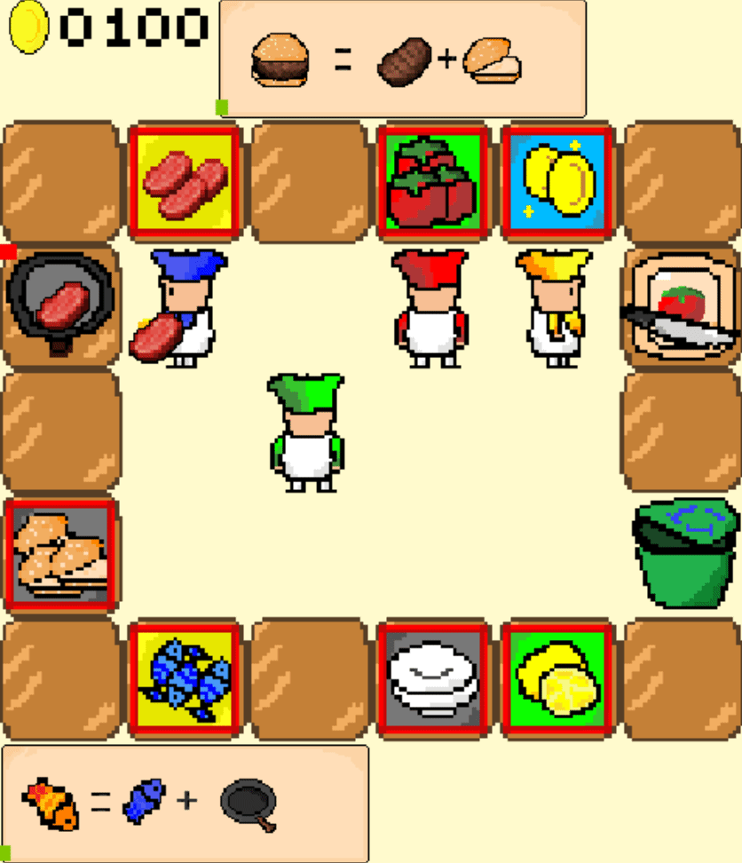

# 分手厨房-pygame 🍳

🌐 [中文](/readme.ch.md) | [English](/readme.md) 🌐

### 简介 🎮:

-----

嗨👋，目前的开源的overcook项目是基于前后端编写的h5游戏🕹️。因为只会python🐍，考察了一下pygame，发现写这样一个游戏很简单🎉，并且可以更加还原游戏原本的一些环境🌍，更加适合python同学👥。以下是游戏场景的动态展示👀：

<p align="center">
  
  
  
</p>
<p align="center">
  <span style="display: inline-block; width: 33%; text-align: left;">2player_overcooked</span>
  <span style="display: inline-block; width: 33%; text-align: center;">2player_agentwithhuan_overcooked</span>
  <span style="display: inline-block; width: 33%; text-align: right;">4player_overcooked</span>
</p>
为了更加适配强化学习🧠，我们做了以下的改进🔧：

首先是游戏逻辑相比简化的overcook更贴近真实的overcooked 2👨‍🍳，真实的overcooked游戏实际上是一个多人多任务的合作游戏👫👬，玩家数量最多是4个人🎮，并且同一时间智能体需要烹饪的菜品可能是多种🍲，多个智能体在完成任务时需要具有分工意识和任务分配意识🤝，这些方面的能力在简化的overcooked环境中体现得不够充分。

此外，简化的overcooked的任务步骤较为简单，例如完成洋葱汤只需要将三个洋葱放入锅中，然后烹饪，送菜🍜，这使得智能体之间的合作模型较为单一。多样的合作模式更加考验智能体之间的配合和协调🤖，也有利于训练合作能力更出色的智能体。

在工程上🔨，原始的overcooked环境的渲染使用的是前端界面，许多方法是自己重定义的，比较冗长，阅读性不佳📚。我们使用pygame实现了基本的游戏逻辑（可能在结构上并不一致，具体可以参考后文的代码结构）👨‍💻。

### 特性 🌟

----

- 原版游戏不同菜品的合成🍽️，如 切好的 柠檬+ 煎好的 鱼+盘子=香煎精鱼🐟，牛肉+番茄+汉堡胚+盘子=牛肉汉堡🍔！
- 步骤任意性🔄，我们像原版游戏一样，提供多路径同终点的合成规则设置，比如番茄汉堡+牛肉和牛肉汉堡+番茄都能合成番茄牛肉汉堡🍅🍔！
- 还原切菜动作✂️，相当于为环境增加了更复杂的中间步骤，切菜时不可移动，移动则暂停切菜！
- 菜单滚动条倒计时⏲️，支持用户自己定义，增加图片和合成菜谱即可！
- 垃圾桶🗑️，原版游戏因为有“煮糊了”这个设定，是需要提供灭火器和垃圾桶来消除烧焦物的影响的。但我们在自然人与agent的合作中发现，如果有时候想要提前备菜，容易遇到做错菜导致桌子不够用的情况，这个时候训练好的智能体就丧失了行动能力。因此还是添加了垃圾桶的设置，希望智能体可以做到有纠错能力。
- 支持用户定义游戏场景🌆，仅需要在maps.json中配置你想要的地图人数和菜谱，你就可以得到全新的环境！
- 提供多功能的强化学习接口🔌，智能体与智能体，人与智能体以及LLM控制智能体！
- 提供了一些基本的绘图接口🎨，如绘制agents的送菜成功率或者每个智能体的移动轨迹热力图等等。

### 安装 🛠️

---

你可以克隆本项目📁：
```git
git clone https://github.com/AlexWanghaoming/llm_rl.git
```
然后参考demo中的示例，构建你自己的overcook
## 代码结构 📐

```
envs/overcook_pygame/
├── assets/                         # 存放游戏资源文件，如图片和音乐
│   ├── chef1/                      #如chef1的资源文件
│   ├──...
├── showpic/                        # 展示用的图片和GIF
│   ├──...
├── demo/                         # 环境接口示例使用样例
│   ├── overcooked_mdp.py                      #提供每个智能体随机动作的使用样例
│   ├── overcooked_human.py                      #提供其中一个智能体为用户可以用键盘控制的使用样例
│   ├── overcooked_llm.py                      #提供智能体的控制由输入给定规则和语义环境信息的语言模型控制
├── _init_.py                   # 初始化模块
├── game_class.py               # overcook游戏类的定义，如playertable等交互体
├── game_main.py                # 主游戏类，利用pygame按照给定的地图实例化对应的游戏地图，以及游戏循环的主逻辑，提供双人进行键盘使用的接口
├── maps.json                   # 游戏地图配置数据，包含难易程度不同，菜谱不同和人数不同的额外配置。
├── overcook_gym_class.py       # 游戏的Gym环境类，相比game_class提供了一些环境主逻辑
├── overcook_gym_main.py        # 定义游戏类，可以通过maps.json中的配置文件构建地图信息，都是静态元素
├── overcook_gym_env.py         # 定义环境类，通过调用overcook_gym_main.py中的游戏类来保证主逻辑，所有和环境相关的信息与配置均在此文件
├── readme.ch.md                    # 中文版README
├── readme.md                       # 英文版README
```
