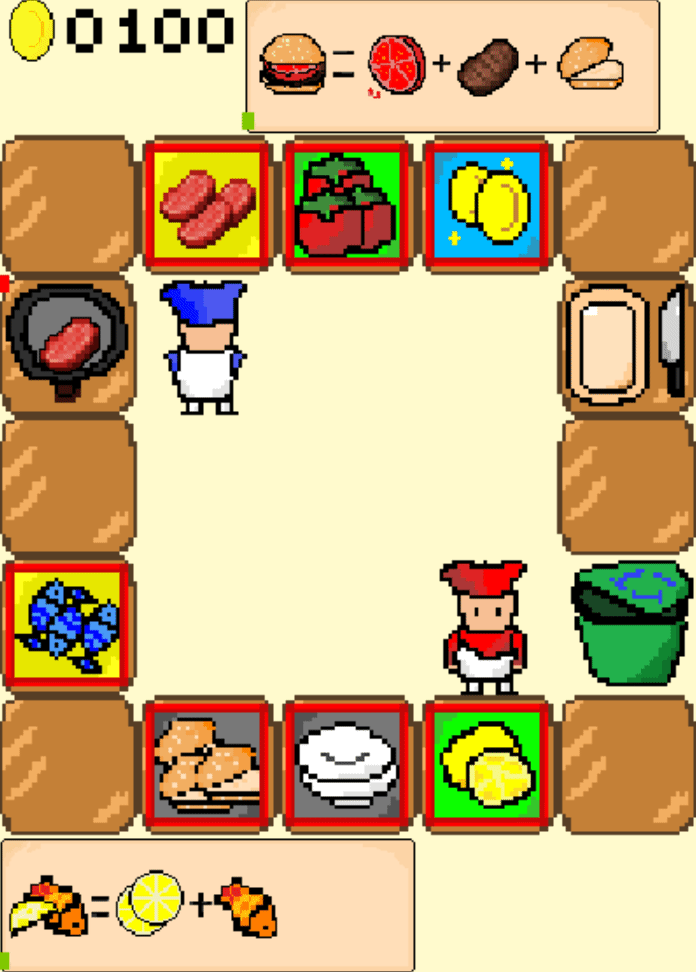
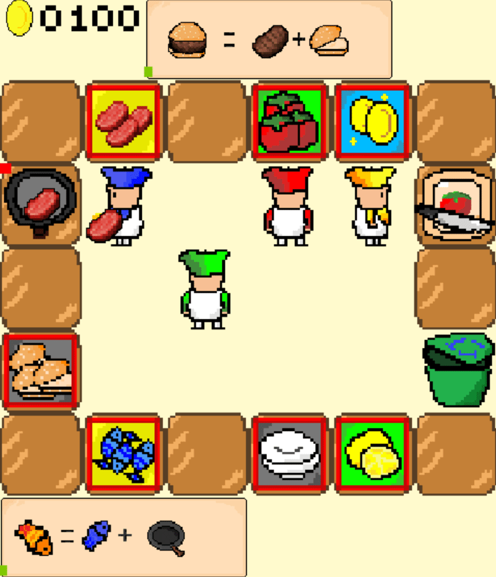

# ComplexOvercooked 🍳

🌐 [中文](/readme.ch.md) | [English](/readme.md) 🌐

### Introduction 🎮:

-----

Hi👋, the current open-source overcook project is an H5 game🕹️ written based on frontend and backend. As I only know Python🐍, I looked into pygame and found that writing such a game is quite simple🎉, and it can better restore some of the original game environments🌍, making it more suitable for Python learners👥. Below is a dynamic display of the game scenes👀:

<p align="center">
  
  
  
</p>
<p align="center">
  <span style="display: inline-block; width: 33%; text-align: left;">2player_overcooked</span>
  <span style="display: inline-block; width: 33%; text-align: center;">2player_agentwithhuan_overcooked</span>
  <span style="display: inline-block; width: 33%; text-align: right;">4player_overcooked</span>
</p>
To better adapt to reinforcement learning🧠, we have made the following improvements🔧:

Firstly, the game logic is closer to the real Overcooked 2👨‍🍳 compared to the simplified Overcooked_AI, which is actually a multiplayer and multitasking cooperative game👫👬. The maximum number of players is four🎮, and at the same time, the agents might need to cook various dishes🍲. Multiple agents need to have a sense of division of labor and task allocation🤝, which is not fully reflected in the simplified overcook environment.

Moreover, the task steps in the simplified overcook are quite simple, like making onion soup only requires putting three onions into the pot, cooking, and serving🍜. This makes the cooperation model among agents quite singular. Diverse modes of cooperation test the coordination and collaboration among agents🤖, which is beneficial for training agents with superior cooperative abilities.

In terms of engineering🔨, the original overcook environment used frontend interface for rendering, and many methods were redefined by oneself, which are quite lengthy and have poor readability📚. We have implemented the basic game logic using pygame (which may not be structurally consistent, see the code structure in the following sections for details)👨‍💻.

### Features 🌟

----

- Original game's different dish combinations🍽️, like chopped lemon + fried fish + plate = Fried Fine Fish🐟, beef + tomato + burger base + plate = Beef Burger🍔!
- Arbitrary steps🔄, like the original game, we provide multiple paths to the same endpoint in the combination rules, such as Tomato Burger + Beef and Beef Burger + Tomato can both make a Tomato Beef Burger🍅🍔!
- Restoring chopping actions✂️, adding more complex intermediate steps to the environment, you can't move while chopping, and moving pauses the chopping!
- Menu scroll bar countdown⏲️, supports user-defined, just add images and recipes!
- Trash can🗑️, the original game needs fire extinguishers and trash cans to eliminate the impact of burnt food due to the "burnt" setting. But we found in cooperation between humans and agents that if you want to prepare dishes in advance, you might encounter the situation of making the wrong dishes leading to a shortage of tables. So we added the trash can setting, hoping the trained agents can correct mistakes.
- Supports user-defined game scenes🌆, you just need to configure the map, number of players, and recipes in maps.json to get a brand new environment!
- Provides a multifunctional reinforcement learning interface🔌, for agent-to-agent, human-to-agent, and LLM-controlled agent interactions!
- Provides some basic drawing interfaces🎨, like drawing agents' successful delivery rates or heatmaps of each agent's movement trajectory, etc.
### Installation 🛠️

---

You can clone this project📁:
```bash
git clone https://anonymous.4open.science/r/ComplexOvercooked-1D82/readme.md
pip install -r requirements.txt
```

### Training 🚀
For example, train ippo agents in the 2playerhard layout: 
```Bash
python src/main.py --config=ippo --env-config=overcooked2 with env_args.map_name=2playerhard
```
To train agents over various algorithms, layouts and seeds in batch:
```Bash
./runalgo.sh
```

### ComplexOvercooked Environment Code Structure 📐

```
ComplexOvercooked/
├── assets/  # Game resource files, such as images of items
├── src/  # Core source code directory
│   ├── components/  # Basic components
│   │   ├── action_selectors.py  # Action selectors (epsilon-greedy, etc.)
│   │   ├── episode_buffer.py    # Experience replay buffer
│   │   ├── epsilon_schedules.py # Epsilon decay scheduler
│   │   ├── standarize_stream.py # Data standardization
│   │   └── transforms.py        # Data transformation tools
│   ├── config/  # Configuration directory
│   │   └── algs/  # Algorithm configurations
│   │       ├── coma.yaml        # COMA algorithm config
│   │       ├── ia2c.yaml        # IA2C algorithm config
│   │       ├── ippo.yaml        # IPPO algorithm config
│   │       ├── iql.yaml         # IQL algorithm config
│   │       └── *_ns.yaml        # Non-shared parameter versions
│   └── envs/  # Environment implementation
│       └── overcook_pygame/  # Overcooked environment
│           ├── overcook_gym_class.py  # Game basic classes (tables, pots, boards, etc.)
│           ├── overcook_gym_env.py    # Gym environment wrapper
│           └── overcook_gym_main.py   # Environment main entry
├── maps.json  # Map configuration file
├── requirements.txt  # Project dependencies
└── runalgo.sh  # Batch training script
```

Main directory description:
- `src/components/`: Contains implementations of reinforcement learning algorithm components, such as action selection, experience replay, etc.
- `src/config/algs/`: Contains configuration files for various algorithms (COMA, IA2C, IPPO, IQL, etc.)
- `src/envs/`: Contains the specific implementation of the Overcooked environment
- `assets/`: Stores game resource materials
- `maps.json`: Used to configure game maps, number of players, and task types
- `runalgo.sh`: Script for batch training with different algorithms and maps
