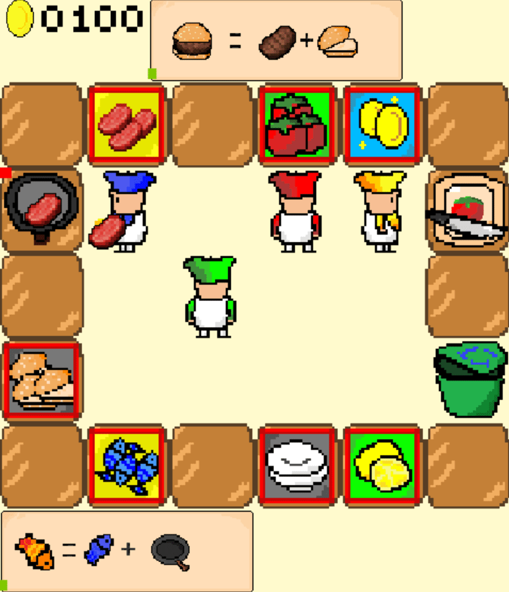
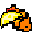

# ComplexOvercooked 🍳

## Introduction 
*ComplexOvercooked* is a multi-agent reinforcement learning (MARL) environment with dynamic objectives. *ComplexOvercooked* will benefit research in the fields of human-AI collaboration and LLMs. We support control interfaces among various types of agents, including reinforcement learning (RL), human players (via keyboard), and LLMs. Below is a dynamic overview of the game scenes👀:
<p align="center">
  
  
</p>
<p align="center">
  <span style="display: inline-block; width: 30%; text-align: left;">2playerhard</span>
  <span style="display: inline-block; width: 30%; text-align: right;">4playereasy</span>
</p> 

Compared to the classic [overcooked_ai](https://github.com/HumanCompatibleAI/overcooked_ai) environment, we have introduced more features to better replicate the cooperative mechanisms of the original Overcooked game:
 - We supports cooperation between two or four agents, and the game map can be flexibly customized through [maps.json](envs/maps.json).
 
 - We support more mechanics from the original Overcooked game, such as cutting food, dish synthesis (e.g., cookedfish + AClemon = AClemoncookedfish), and garbage disposal.
 
 - The task objectives are dynamic, currently supporting 4 types of orders (i.e., AClemoncookedfish, cookedfish, ACtomatocookedbeefhamburger, cookedbeefhamburger). These orders switch during the game according to a configurable probability distribution, introducing additional non-stationarity in MARL.

 - For LLM agent, we employ a hierarchical control strategy where the LLM generates medium-level policies. These policies are then translated into specific executable actions through heuristic rules and A* algorithm-based search.

## Updates

- [x] Supports MARL agent, Human keyboard, LLM agent.
- TODO: Support PettingZoo API

## Installation 🛠️
You can clone this project📁:
```bash
git clone https://anonymous.4open.science/r/ComplexOvercooked-1D82/readme.md
pip install -r requirements.txt
```

## Training MARL agents 🚀
For example, train ippo agents in the 2playerhard layout: 
```Bash
python src/main.py --config=ippo --env-config=overcooked2 with env_args.map_name=2playerhard
```
To train agents over various algorithms, layouts and seeds in batch:
```Bash
./runalgo.sh
```
Current supported MARL algorithms include ippo, iql, vdn.
## Test :v:
Evaluate the performance of agents ("llm", "human", "rl", "random") collaboration. p0 and p1 can be chosen from ["llm", "human", "rl", "random"], for example: 
```Bash
python tests/agents/test_agent.py --p0=rl --p1=human --map_name=supereasy --n_episode=5
```


## Main directory description
- `envs/`: Contains the specific implementation of the Overcooked environment
- `envs/overcooked_gym_env`: Contains the gym env of CompleOvercooked. 
- `envs/overcooked_class`: Contains the class used in CompleOvercooked. 
- `envs/overcooked__main`: Contains the game initialization of CompleOvercooked. 
- `envs/agents`: Contains the class of the human, llm and RL agents. 
- `envs/`: Contains the implementation of the Overcooked environment
- `prompts`: Contains prompts used in LLM agent.
- `src/`: Contains config files and main implementation of various MARL algorithms (IPPO, VDN, IQL, etc.)
- `tests/`: Stores game resource materials

# Acknowledgement
Our code is built upon some prior works.

* ComplexOvercooked is an update of Overcooked environment (https://github.com/HumanCompatibleAI/overcooked_ai).
* The implementation of LLM agent is adapted from https://github.com/PKU-Alignment/ProAgent.
* The implementation of MARL agents is adapted from https://github.com/uoe-agents/epymarl.
